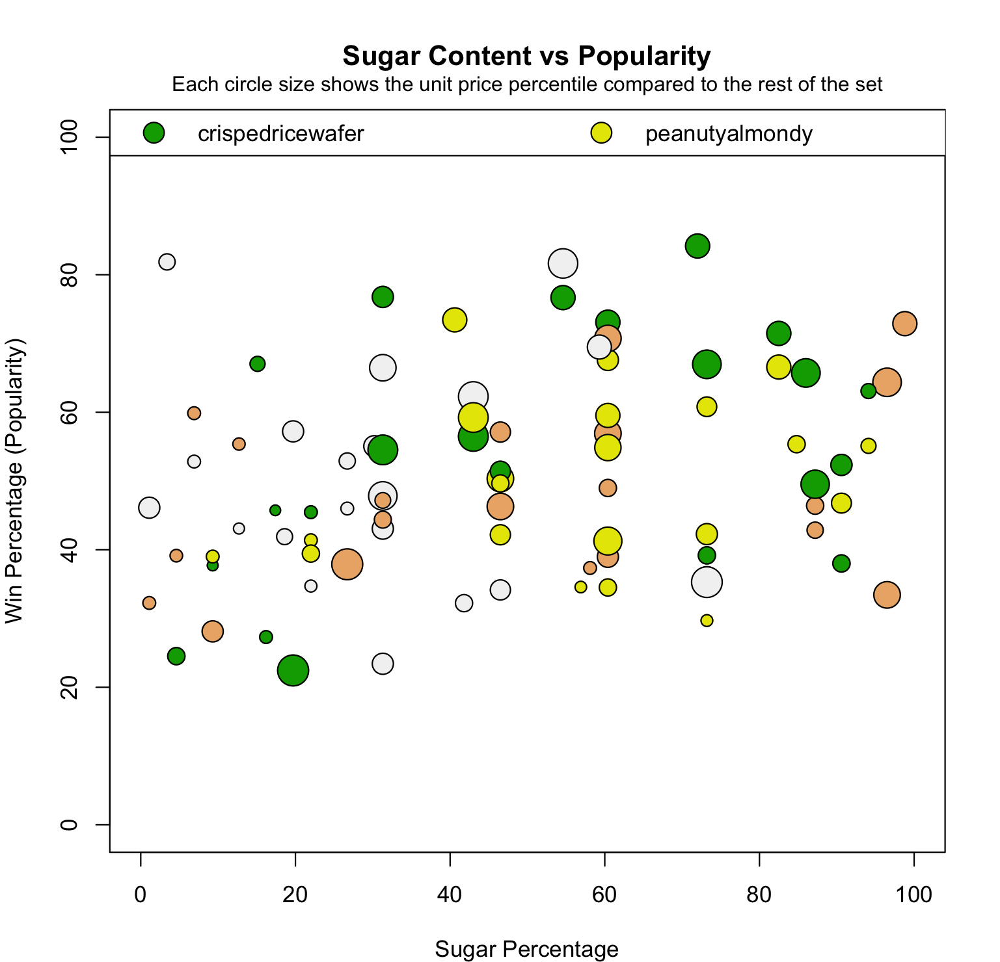

# Candy Data Analysis

This project (task_1.R) analyzes candy ingredient popularity and the relationship between sugar content, price, and popularity using a dataset of candies.

## Dataset
The dataset `CMM703 Candy Data 2024-2025.csv` contains information about various candies including:
- Ingredients (binary features)
- Win percentage (popularity measure)
- Sugar percentage
- Price percentage

## Analysis

### 1. Favorite Candy Ingredients Analysis
- Calculates average win percentage for each candy ingredient
- Creates a bar chart showing ingredient popularity
- Key findings:
  - Most popular ingredient: "crispedricewafer"
  - Least popular: "hard" candies
  - 5 ingredients achieve more than 50% popularity
  - Chocolate and nougat have nearly equal popularity

### 2. Sugar Content vs Popularity Analysis
- Examines relationship between sugar content and candy popularity
- Visualizes data with bubble size representing price percentile
- Key findings:
  - Popular candies tend to have higher sugar content
  - Popular and sugary candies are generally more expensive
  - Data is scattered between 20-85% win percentage

## Code Structure
1. Loads and processes candy data
2. Analyzes ingredient popularity:
   - Calculates average win percentage per ingredient
   - Creates sorted, colored bar chart with value labels
3. Analyzes sugar-popularity relationship:
   - Creates scatter plot with price represented by bubble size
   - Adds legend and reference line

## Requirements
- R programming language
- Base R graphics (no additional packages required)

## How to Run
1. Place the CSV file in your working directory
2. Run the R script
3. Plots will be generated in the R graphics device

## Interpretation
The analysis suggests:
- Certain ingredients (like crispedricewafer) significantly boost candy popularity
- There's a positive correlation between sugar content and popularity
- Popular, sugary candies tend to be priced higher